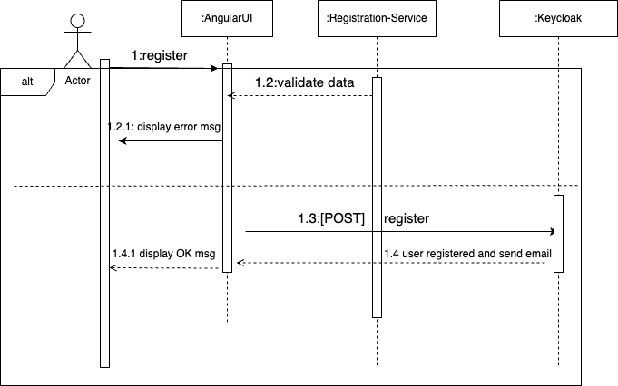

# Registration-Service 
## Purpose of this service is to register merchant user (owner of multiple shops) into keycloak.
### Registration is done throughout keycloak rest api, not sure if this is the best way but for practicing and making your own life more miserable is perfect.

#### 5-min made UML sequence diagram:
[]
